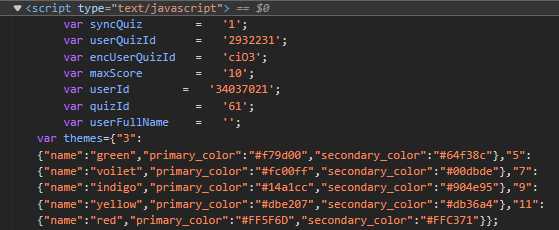
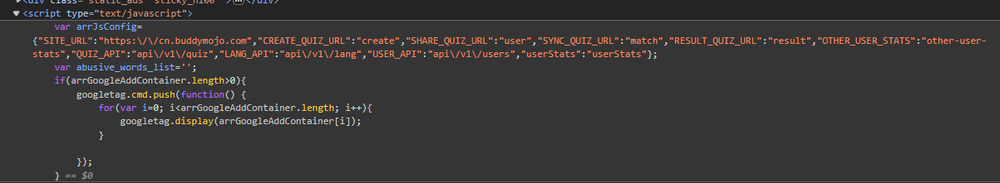
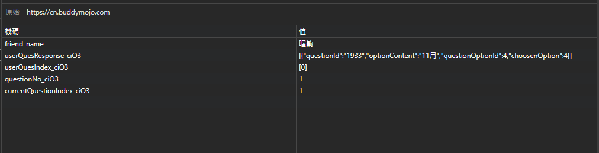
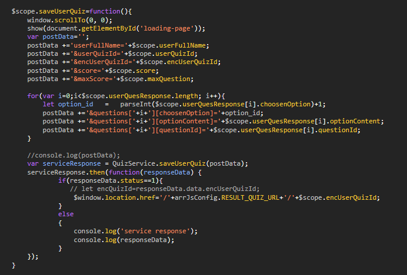

# [心得] XX的永遠的最好的夥伴 - 攻擊心得

## 前言
本人是一個資安菜雞，打網頁只是為了學習CTF技巧，所以這篇文章只是紀錄一下自己打的過程與心得，如果有錯誤的地方，還請各方大德指教。

並且，本文僅沒有任何惡意攻擊及針對性破壞行為，也希望不要有有心人士利用本文的內容進行任何非法行為。

而且，我沒把網頁打完，因為我要去跟女友約會所以只花了10分鐘去翻code，之後有機會再補上腳本。

## 緣起
前幾天FB友列分享一個互動網頁，內容是要我們去玩他設定的題目，根據我們的分數決定對他的了解程度。

然後我答第一題就錯，超好笑。

同時我注意到，答題的同時答案就會秀出來了，所以我就想說，這個網頁應該是沒有做太多安全防護，所以就開始挖起來了。

## 分析
1. 打開Devlopment Tools，稍微翻一下script欄位，發現有兩坨有用的資訊
    1. 這邊存了一些還不知道是啥的變數。
        
    2. 而這邊存了一些看起來是API路徑的變數。
        
2. 接著檢查一下Applications的部分，按慣例翻一下cookie跟local storage。然後我們就抓到他會將我們所選的答案存在local storage裡面。
    
3. 由於他在作答過程中沒有任何與server的交互，所以推斷他在開始的時候就會先戳一次以拿到所有答案，並且將答案存起來待作答完畢後再送出儲存分數。
4. 直接清掉本機的答案，然後從network裡面看到他拿問題的API(或者也可以跟我一樣慢慢看他的code)。我們以樣學樣戳戳看，會拿到所有問題包含答案本身。
```js
fetch('/api/v1/quiz/'+quizId+'?userQuizId='+userQuizId+'&type=friend&stats=1')
.then(response => response.json())
.then(data => {
    console.log(data.data.questions);
})
.catch(err => console.log(err));
```
5. 然後我們就可以拿到所有的答案了，接著我們可以送出一次看看submit的API長怎樣。如果不想浪費一次扣打，也可以跟我一樣直接翻code，我猜大概是沒渲染好，或者他根本沒藏，反正code是被我看光光了，直接就挖出了submit用的API。
6. 接著拿到API之後，我們仿照Local Storage裡面答案的格式做一下POST DATA(有點不一樣，詳情看下面的圖片)，把答案塞進去POST一下API，就可以拿滿分了。
    
7. 然後就可以拿去騙朋友了(X)

## 結論
正常的網頁不該這麼好打，這個明顯是安全性沒做好而已。
之後如果有做寫出一個完整的一條龍腳本，我會再補上來。